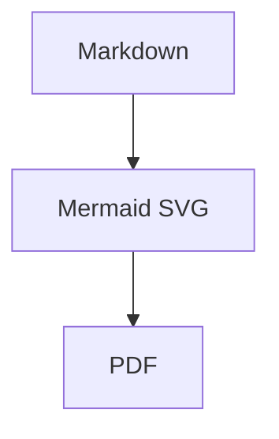

# mdtopdf

`mdtopdf` converts Markdown files to PDF with a pure Python command
surface:

```text
markdown-it-py -> HTML + CSS -> WeasyPrint -> PDF
```

It does not use Pandoc. Version 1 is stateless and does not provide REPL,
project files, undo, or redo.

## Prerequisites

- Python 3.10+
- Python packages installed by this package: `click`, `markdown-it-py`,
  `mdit-py-plugins`, `pygments`, `mini-racer`, `latex2mathml`,
  `matplotlib`, `weasyprint`
- Native WeasyPrint libraries: Pango, GLib, Cairo

On Windows, install the native libraries separately. A common MSYS2 setup is:

```powershell
winget install MSYS2.MSYS2
pacman -S mingw-w64-x86_64-pango
setx WEASYPRINT_DLL_DIRECTORIES "D:\Environment\msys64\mingw64\bin"
```

Run `mdtopdf doctor` after installation to verify the environment.

## Installation

```powershell
python -m pip install mdtopdf
```

For local development:

```powershell
git clone https://github.com/ABClize/mdtopdf.git
cd mdtopdf
python -m pip install -e .[dev]
```

## Usage

```powershell
mdtopdf convert .\report.md -o .\report.pdf
mdtopdf convert .\report.md -o .\report.pdf --overwrite
mdtopdf convert .\report.md -o .\report.pdf --css .\print.css --title "Report"
mdtopdf convert .\report.md -o .\report.pdf --header "Report" --footer "Draft"
mdtopdf convert .\report.md -o .\report.pdf --no-header --no-footer
mdtopdf convert .\report.md -o .\report.pdf --base-url .\assets
mdtopdf convert .\report.md -o .\report.pdf --resource-dir .\attachments
mdtopdf convert .\trusted.md -o .\trusted.pdf --unsafe-html
mdtopdf html .\report.md -o .\report.html --overwrite
```

JSON output is available either before the command or on the command itself:

```powershell
mdtopdf --json convert .\report.md -o .\report.pdf --overwrite
mdtopdf convert .\report.md -o .\report.pdf --overwrite --json
```

## Python API

The public Python API is Obsidian-compatible by default. Callers pass Markdown
text or a Markdown file and the same frontmatter, comment, wikilink, emphasis,
math, Mermaid, and safe-HTML handling used by the CLI is applied.

```python
from mdtopdf import (
    markdown_file_to_html,
    markdown_file_to_pdf,
    markdown_to_html,
    markdown_to_pdf,
)

rendered = markdown_to_html("# Report\n\n==highlight==")
print(rendered.html)

markdown_to_pdf("# Report\n\nBody", "report.pdf", title="Report", overwrite=True)
markdown_file_to_html("report.md", output_path="report.html", overwrite=True)
markdown_file_to_pdf("report.md", output_path="report.pdf", overwrite=True)
```

## Commands

- `convert INPUT.md -o OUTPUT.pdf`: render Markdown to PDF.
- `html INPUT.md -o OUTPUT.html`: render the same Markdown pipeline to
  standalone HTML for fast browser style preview.
- `doctor`: check Python package imports, WeasyPrint initialization, and common
  Windows DLL paths.
- `themes list`: list built-in themes. Version 1 ships `default`.

`convert` and `html` add page header and footer CSS by default. The header uses the input
file stem, and the footer shows page numbers. Use `--header TEXT`,
`--footer TEXT`, `--no-header`, `--no-footer`, and `--no-page-numbers` to adjust
that output.

`--base-url` sets the renderer base path for relative resources already present
in the generated HTML. `--resource-dir` is a local lookup directory for bare
image names such as `![[image.png]]` or ``. It does not search
recursively and does not alter image paths that already include a directory.

The default theme includes document-oriented table, blockquote, callout, code
block, and Mermaid diagram styling. Custom CSS passed with `--css custom.css` is
appended after the selected theme, so it can override the built-in styling.

## Markdown Features

- CommonMark
- Tables
- Strikethrough
- Task lists
- Footnotes
- Heading anchors
- Fenced code blocks with Pygments highlighting
- Obsidian-style `==highlight==` marks.
- Obsidian-style `[[target|alias]]` wikilinks. In tables, escaped separators
  such as `[[target\|alias]]` render as normal links.
- Obsidian-style `%%comment%%` comments outside code are hidden.
- Obsidian/YAML frontmatter at the start of the file is hidden.
- Obsidian-style callouts such as `> [!note] Title` become typed callout
  blockquotes that themes can style.
- A safe HTML subset for document-authoring tags: `<br>`, `<kbd>`,
  `<big>`, `<small>`, `<sup>`, `<sub>`, `<mark>`, `<strong>`, `<em>`,
  `<b>`, `<i>`, `<u>`, `<s>`, `<del>`, `<ins>`, `<span>`, `<ruby>`,
  `<rt>`, `<rp>`, `<abbr>`, `<hr>`, and `<wbr>`. Legacy
  `<font color="...">` is converted to safe color-only `<span>` output, and
  color-only styles on text-formatting tags are preserved. Other raw HTML and
  unsafe attributes stay escaped by default. HTML comments outside code are
  hidden instead of printed.
- LaTeX math formulas through `$inline$`, `$$block$$`, and common `amsmath`
  environments. Formulas render offline through bundled KaTeX assets running
  in Python with `mini-racer`; no user Node.js install, remote JavaScript, or
  CDN is required. SVG, MathML, chemistry HTML, and array-table rendering remain
  fallbacks for unsupported TeX.
- Mermaid diagrams in fenced code blocks, rendered to SVG only when local
  `mmdc` is installed. Without `mmdc`, Mermaid blocks remain highlighted code.

Raw HTML is disabled by default except for the safe subset above. For trusted
local Markdown, pass `--unsafe-html` to allow raw HTML through to WeasyPrint.

## Mermaid Diagrams

Mermaid is a JavaScript renderer. For offline-stable Python wheel usage, this
package only uses a persistent local `mmdc` command from
`@mermaid-js/mermaid-cli`. It does not call Mermaid.ink and does not download
`@mermaid-js/mermaid-cli` through `npx` during conversion.

Example:

````markdown

````

To enable Mermaid diagram rendering, install a persistent local renderer with:

```powershell
npm install -g @mermaid-js/mermaid-cli
```

If `mmdc` is not available, conversion still succeeds and Mermaid fenced blocks
remain visible as code. Run `mdtopdf doctor --json` to check whether
Mermaid rendering is available.

## Running Tests

```powershell
python -m pip install -e .[dev]
python -m pytest tests/ -v -s --tb=no
$env:MDTOPDF_FORCE_INSTALLED = "1"
python -m pytest tests/ -v -s --tb=no
```

## License

Apache-2.0. Bundled KaTeX assets are distributed under the MIT license; see
`mdtopdf/vendor/katex/LICENSE`.
