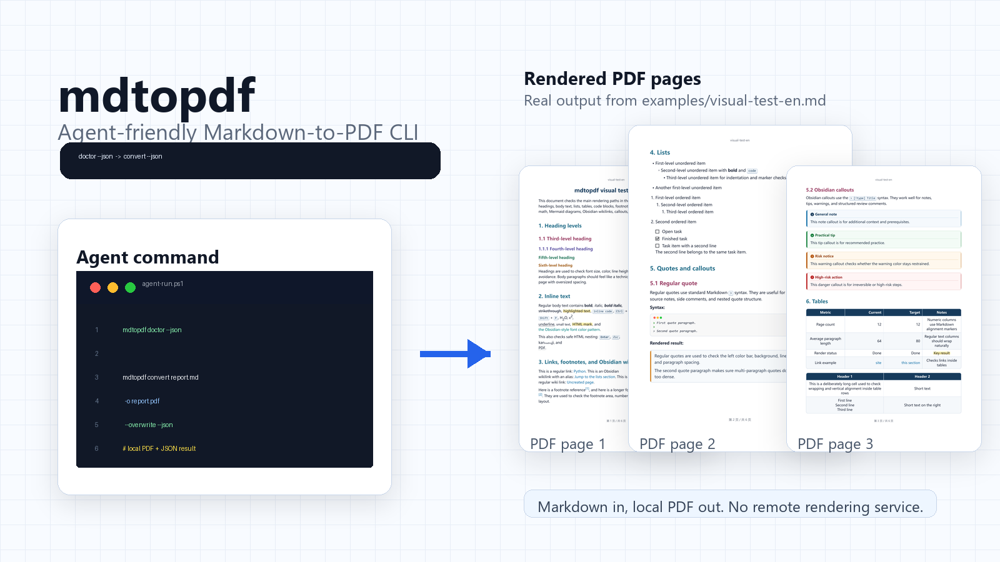
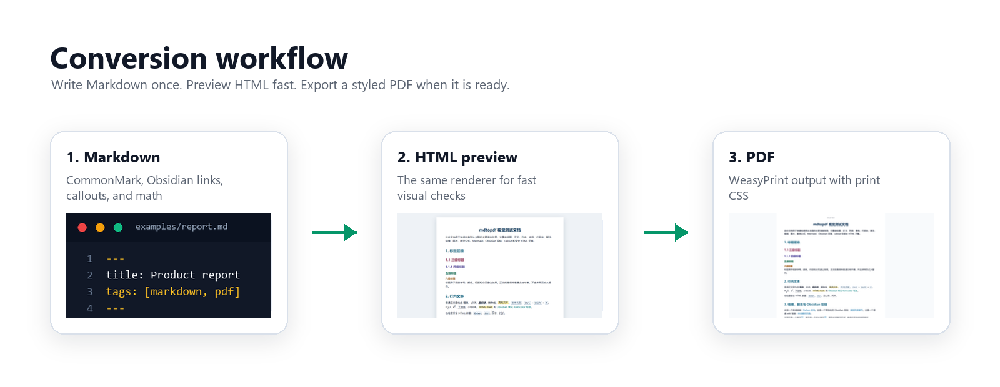
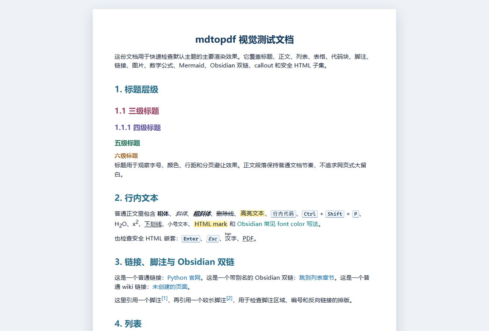
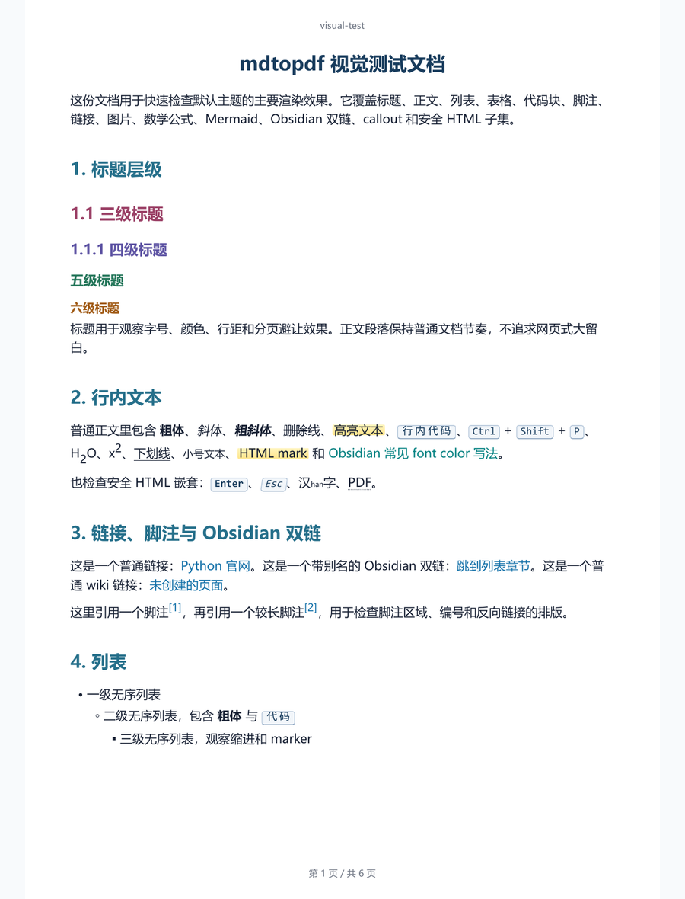
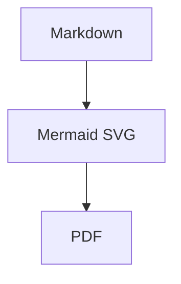

# mdtopdf

[](https://pypi.org/project/mdtopdf/)
[](https://pypi.org/project/mdtopdf/)
[](https://github.com/ABClize/mdtopdf/blob/main/LICENSE)
[](https://github.com/ABClize/mdtopdf)

Convert Markdown to polished PDFs with a clean Python CLI.

`mdtopdf` is a cross-platform Markdown to PDF tool built around
`markdown-it-py`, standalone HTML preview, and Python WeasyPrint. It is designed
for local documents, Obsidian-style notes, technical reports, and automation
workflows that need predictable command-line output.



```shell
python -m pip install mdtopdf
mdtopdf convert report.md -o report.pdf
```

`mdtopdf` does not use Pandoc. Version 1 is stateless and does not provide REPL,
project files, undo, or redo.

## Start Here

| You want to... | Go to |
| --- | --- |
| Install and convert a file | [Quick Start](#quick-start) |
| See the rendered output | [Visual Output](#visual-output) |
| Preview styles before PDF export | [HTML Preview](#html-preview) |
| Use it from Python | [Python API](#python-api) |
| Check platform dependencies | [Platform Notes](#platform-notes) |
| Understand the internals | [Architecture](https://github.com/ABClize/mdtopdf/blob/main/docs/architecture.md) |

## Quick Start

Install the package:

```shell
python -m pip install mdtopdf
```

Check your environment:

```shell
mdtopdf doctor
```

Convert Markdown to PDF:

```shell
mdtopdf convert report.md -o report.pdf
```

Try the bundled visual test document from a cloned checkout:

```shell
git clone https://github.com/ABClize/mdtopdf.git
cd mdtopdf
python -m pip install -e .[dev]
mdtopdf convert examples/visual-test.md -o visual-test.pdf --overwrite
mdtopdf html examples/visual-test.md -o visual-test.html --overwrite
```

## Visual Output

`mdtopdf` uses the same Markdown rendering pipeline for both HTML preview and
PDF export, so you can tune styles quickly before producing the final document.



| HTML preview | PDF output |
| --- | --- |
|  |  |

## Features

| Feature | What it gives you |
| --- | --- |
| CommonMark rendering | Tables, strikethrough, task lists, footnotes, heading anchors, and fenced code blocks. |
| Obsidian-compatible authoring | Wikilinks, aliases, frontmatter hiding, comments, highlights, and typed callouts. |
| Math without a CDN | Inline and block TeX through bundled KaTeX assets running locally in Python. |
| Mermaid support | Fenced Mermaid blocks render to SVG when a local `mmdc` command is installed. |
| Safe HTML subset | Common inline document tags are allowed while unsafe raw HTML stays escaped by default. |
| Themed output | Built-in print CSS plus optional custom CSS appended after the selected theme. |
| HTML preview | Generate standalone HTML before PDF export for fast browser-based style checks. |
| Automation-friendly CLI | `--json` output is available for scripts, agents, and CI jobs. |
| Python API | Convert strings or files from your own Python code. |

## Usage

Render a PDF:

```shell
mdtopdf convert report.md -o report.pdf
mdtopdf convert report.md -o report.pdf --overwrite
```

Customize document metadata and page chrome:

```shell
mdtopdf convert report.md -o report.pdf --title "Report"
mdtopdf convert report.md -o report.pdf --header "Report" --footer "Draft"
mdtopdf convert report.md -o report.pdf --no-header --no-footer
```

Use extra CSS or resource lookup paths:

```shell
mdtopdf convert report.md -o report.pdf --css print.css
mdtopdf convert report.md -o report.pdf --base-url assets
mdtopdf convert report.md -o report.pdf --resource-dir attachments
```

Allow raw HTML only for trusted local Markdown:

```shell
mdtopdf convert trusted.md -o trusted.pdf --unsafe-html
```

Emit machine-readable JSON:

```shell
mdtopdf --json convert report.md -o report.pdf --overwrite
mdtopdf convert report.md -o report.pdf --overwrite --json
```

## HTML Preview

Generate standalone HTML with the same Markdown, theme, math, Mermaid, resource
resolution, and safe-HTML handling used by PDF conversion:

```shell
mdtopdf html report.md -o report.html --overwrite
```

This is useful for fast checks of typography, spacing, tables, code blocks,
callouts, images, math, and Mermaid rendering. Use the generated PDF for final
checks of page size, headers, footers, pagination, and cross-page layout.

## Commands

| Command | Description |
| --- | --- |
| `mdtopdf convert INPUT.md -o OUTPUT.pdf` | Render Markdown to PDF. |
| `mdtopdf html INPUT.md -o OUTPUT.html` | Render standalone HTML for style preview. |
| `mdtopdf doctor` | Check Python imports, WeasyPrint initialization, and common Windows DLL paths. |
| `mdtopdf themes list` | List built-in themes. Version 1 ships `default`. |

`convert` and `html` add page header and footer CSS by default. The header uses
the input file stem, and the footer shows page numbers. Use `--header TEXT`,
`--footer TEXT`, `--no-header`, `--no-footer`, and `--no-page-numbers` to adjust
that output.

`--base-url` sets the renderer base path for relative resources already present
in the generated HTML. `--resource-dir` is a local lookup directory for bare
image names such as `![[image.png]]` or ``. It does not search
recursively and does not alter image paths that already include a directory.

## Python API

The public Python API is Obsidian-compatible by default. Callers can pass
Markdown text or a Markdown file and get the same frontmatter, comment,
wikilink, emphasis, math, Mermaid, and safe-HTML handling used by the CLI.

```python
from mdtopdf import (
    markdown_file_to_html,
    markdown_file_to_pdf,
    markdown_to_html,
    markdown_to_pdf,
)

rendered = markdown_to_html("# Report\n\n==highlight==")
print(rendered.html)

markdown_to_pdf("# Report\n\nBody", "report.pdf", title="Report", overwrite=True)
markdown_file_to_html("report.md", output_path="report.html", overwrite=True)
markdown_file_to_pdf("report.md", output_path="report.pdf", overwrite=True)
```

## Markdown Support

`mdtopdf` supports:

- CommonMark
- Tables
- Strikethrough
- Task lists
- Footnotes
- Heading anchors
- Fenced code blocks with Pygments highlighting
- Obsidian-style `==highlight==` marks
- Obsidian-style `[[target|alias]]` wikilinks
- Obsidian-style `%%comment%%` comments outside code
- Obsidian/YAML frontmatter hiding at the start of the file
- Obsidian-style callouts such as `> [!note] Title`
- Safe inline HTML tags such as `<br>`, `<kbd>`, `<mark>`, `<sup>`, and `<sub>`
- TeX math through `$inline$`, `$$block$$`, and common `amsmath` environments
- Mermaid diagrams through local `mmdc`, when installed

Raw HTML is disabled by default except for the safe subset above. For trusted
local Markdown, pass `--unsafe-html` to allow raw HTML through to WeasyPrint.

## Mermaid Diagrams

Mermaid is optional. For offline-stable Python wheel usage, `mdtopdf` only uses
a persistent local `mmdc` command from `@mermaid-js/mermaid-cli`. It does not
call Mermaid.ink and does not download `@mermaid-js/mermaid-cli` through `npx`
during conversion.

Example:

````markdown

````

Install a persistent local renderer with:

```shell
npm install -g @mermaid-js/mermaid-cli
```

If `mmdc` is not available, conversion still succeeds and Mermaid fenced blocks
remain visible as code. Run `mdtopdf doctor --json` to check whether Mermaid
rendering is available.

## Platform Notes

`mdtopdf` requires Python 3.10+ and installs its Python dependencies from PyPI,
including `click`, `markdown-it-py`, `mdit-py-plugins`, `pygments`,
`latex2mathml`, `matplotlib`, `mini-racer`, and `weasyprint`.

WeasyPrint also needs native libraries such as Pango, GLib, and Cairo. Linux
and macOS package managers usually provide these through system packages.

On Windows, install the native libraries separately. A common MSYS2 setup is:

```powershell
winget install MSYS2.MSYS2
```

Then install Pango from an MSYS2 MINGW64 shell:

```shell
pacman -S mingw-w64-x86_64-pango
```

Finally, point WeasyPrint at the DLL directory from PowerShell. Adjust the path
if MSYS2 is installed somewhere else:

```powershell
setx WEASYPRINT_DLL_DIRECTORIES "C:\msys64\mingw64\bin"
```

Run this after installation:

```shell
mdtopdf doctor --json
```

## Development

```shell
git clone https://github.com/ABClize/mdtopdf.git
cd mdtopdf
python -m pip install -e .[dev]
python -m pytest tests/ -q
```

Build and check the package:

```shell
python -m build
python -m twine check dist/*
```

## License

Apache-2.0. Bundled KaTeX assets are distributed under the MIT license; see
`mdtopdf/vendor/katex/LICENSE`.
