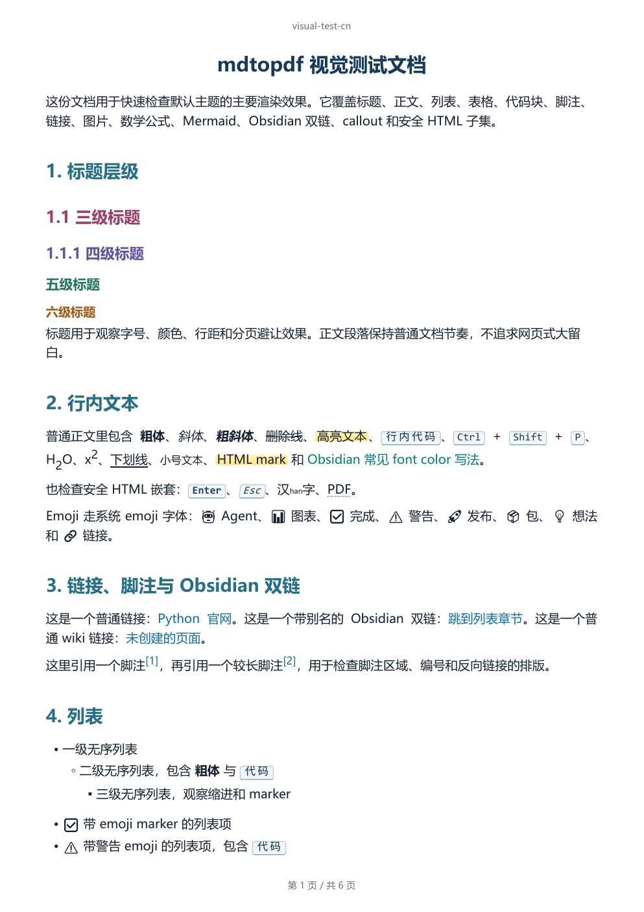
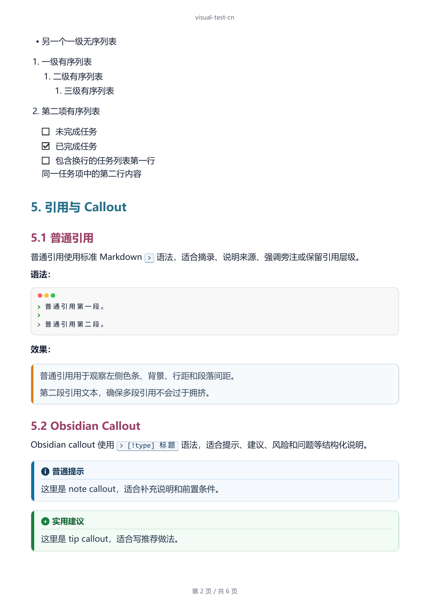
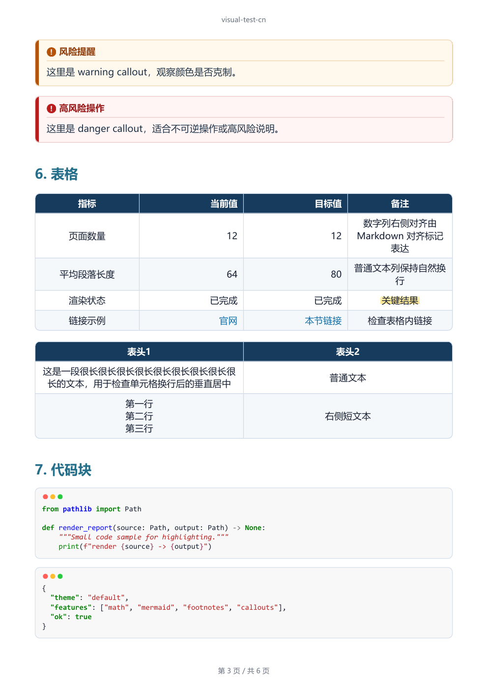
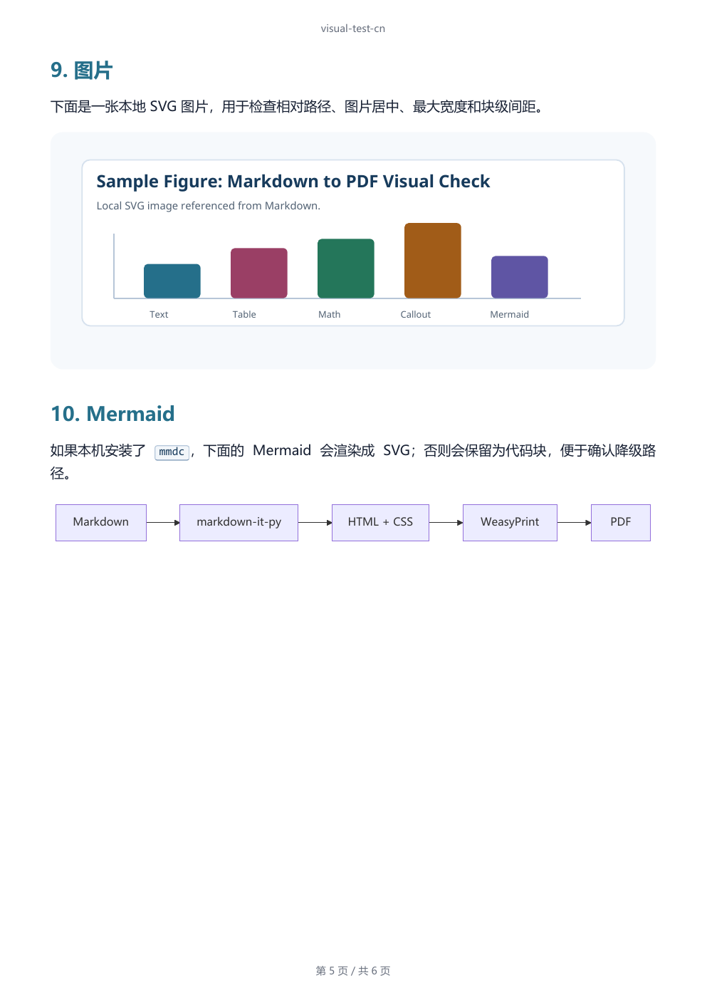
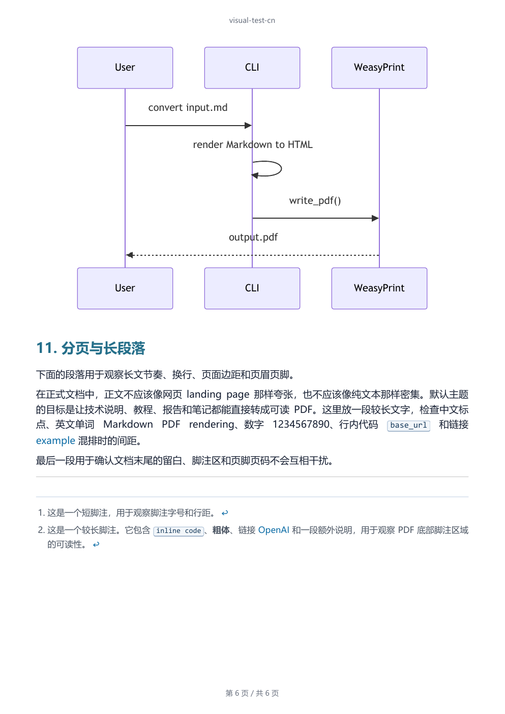

<h1 align="center">mdtopdf：面向 Agent 的 Markdown 转 PDF CLI</h1>

<p align="center">
  <a href="README.md">English README</a> | 中文文档
</p>

<p align="center">
  <a href="#快速上手"></a>
  <a href="#agent-调用方式"></a>
  <a href="#输出效果"></a>
  <a href="https://pypi.org/project/agent-markdown-pdf/"></a>
  <a href="https://github.com/ABClize/mdtopdf/blob/main/LICENSE"></a>
</p>

<p align="center">
  
  
  
  
</p>

**一行命令**，让Agent实现markdown转pdf自主可控。

<p align="center">
  
</p>

---

## 为什么适合 Agent 调用？

Agent 很擅长写 Markdown，但是它用各种方式导出的pdf样式无法统一，mdtopdf则是一个
能让用户提前定义样式的命令行接口。

- **Agent友好** - `mdtopdf --help` 是 Agent 能理解的接口说明。
- **需要时输出 JSON** - 转换、HTML 预览、环境检查、主题列表都可以返回结构化结果。
- **本地文件进，本地文件出** - 不依赖浏览器，不上传文档，不依赖远程渲染服务。
- **不仅支持普通 Markdown** - Obsidian 双链、高亮、frontmatter、评论和 callout 都能渲染。

## 快速上手

安装：

```powershell
python -m pip install agent-markdown-pdf
```

PyPI 发行包叫 `agent-markdown-pdf`，安装后提供的命令仍然是 `mdtopdf`。
不要把 `mdtopdf` 当作 PyPI 包名；发布包名和命令名是故意分开的。

| 用途 | 名称 |
| --- | --- |
| 从 PyPI 安装 | `agent-markdown-pdf` |
| 执行 CLI | `mdtopdf` |
| Python import | `mdtopdf` |

检查本机环境：

```powershell
mdtopdf doctor --json
```

转换文件：

```powershell
mdtopdf convert report.md -o report.pdf --overwrite
```

跑仓库里的测试文档：

```powershell
git clone https://github.com/ABClize/mdtopdf.git
cd mdtopdf
python -m pip install -e .[dev]
mdtopdf html examples/visual-test-cn.md -o visual-test-cn.html --overwrite
mdtopdf convert examples/visual-test-cn.md -o visual-test-cn.pdf --overwrite --json
```

同一份视觉测试也提供英文版：`examples/visual-test-en.md`。

## Agent 调用方式

内置 Agent skill 放在 `mdtopdf/skills/SKILL.md`，源码和 PyPI 包里都会带上。
其他 Agent 如果需要一份紧凑的调用说明，直接看这个文件就够了。

```powershell
mdtopdf doctor --json
mdtopdf convert report.md -o report.pdf --overwrite --json
```

需要看版式时，加一个 HTML 预览：

```powershell
mdtopdf html report.md -o report.html --overwrite --json
mdtopdf convert report.md -o report.pdf --overwrite --json
```

`convert --json` 会返回输入路径、输出路径、文件大小、主题、字体检查摘要、warning 和渲染方式。转换失败时，
JSON 里会有结构化错误，Agent 可以直接把命令、原因和下一步修复建议交代清楚。

## 输出效果

下面 6 张图来自 `examples/visual-test-cn.md`，能看到标题、Callout、表格、代码、
公式、图片、Mermaid 和分页的实际效果。

| 第 1 页 | 第 2 页 |
| --- | --- |
|  |  |
| 第 3 页 | 第 4 页 |
|  |  |
| 第 5 页 | 第 6 页 |
|  |  |

## 工作方式

```text
Markdown -> markdown-it-py HTML -> theme/custom CSS -> WeasyPrint PDF
```

Mermaid 是可选扩展。本地有 `mmdc` 时，Mermaid 代码块会渲染成 SVG；没有
`mmdc` 时，仍会生成pdf，但Mermaid部分会保留为高亮代码块。

## 功能特性

| 功能 | 说明 |
| --- | --- |
| JSON 输出 | `convert`、`html`、`doctor`、`themes list` 都支持 `--json`。 |
| 环境检查 | `doctor --json` 会检查 Python 包、WeasyPrint 原生库、Windows DLL 路径、Mermaid 可用性和推荐字体。 |
| 本地渲染 | Markdown、CSS、数学公式、Mermaid SVG 生成和 PDF 导出都在本机完成。 |
| HTML 预览 | 生成 standalone HTML，用来快速检查最终 PDF 之前的排版。 |
| Obsidian 兼容 | 支持 wikilink、别名、frontmatter 隐藏、评论、高亮和 typed callout。 |
| 文档型 Markdown | 支持表格、任务列表、脚注、标题锚点、代码块和 Pygments 高亮。 |
| KaTeX 数学公式 | 内置 KaTeX 资源渲染行内和块级 TeX，不需要 CDN。 |
| 安全 HTML 默认值 | 常见文档标签可以用，危险的原始 HTML 默认转义。 |
| Python API | 可以在 Python 代码里转换字符串或文件。 |

## 常用命令

生成 PDF：

```powershell
mdtopdf convert report.md -o report.pdf
mdtopdf convert report.md -o report.pdf --overwrite
```

生成 HTML 预览：

```powershell
mdtopdf html report.md -o report.html --overwrite
```

设置标题、页眉、页脚：

```powershell
mdtopdf convert report.md -o report.pdf --title "Report"
mdtopdf convert report.md -o report.pdf --header "Report" --footer "Draft"
mdtopdf convert report.md -o report.pdf --no-header --no-footer
```

追加自定义 CSS 或指定资源目录：

```powershell
mdtopdf convert report.md -o report.pdf --css print.css
mdtopdf convert report.md -o report.pdf --base-url assets
mdtopdf convert report.md -o report.pdf --resource-dir attachments
```

自定义样式统一写在 CSS 里，不需要单独的字体参数。版心、字号、颜色、间距、字体都可以放进同一个 `print.css`。系统已安装的字体可以直接写 `font-family`；如果要随项目带本地字体文件，可以在 CSS 里写 `@font-face`。CSS 里的相对路径会按 Markdown 的 `--base-url` 解析，需要时显式传 `--base-url`。

```css
@font-face {
  font-family: "Report Sans";
  src: url("fonts/NotoSansSC-Regular.otf");
}

:root {
  font-family: "Report Sans", "Noto Sans SC", "Source Han Sans SC", sans-serif;
}

code,
pre {
  font-family: "Cascadia Code", "Liberation Mono", monospace;
}
```

然后把 CSS 传给转换命令：

```powershell
mdtopdf convert report.md -o report.pdf --css print.css --base-url .
```

导出时，`mdtopdf` 会检查最终 CSS 里的字体栈。字体缺失不会阻断 PDF 生成，但会在命令行 warning 和 JSON 的 `warnings` 字段里提示。

输出 JSON：

```powershell
mdtopdf --json convert report.md -o report.pdf --overwrite
mdtopdf doctor --json
mdtopdf themes list --json
```

只在可信 Markdown 中允许原始 HTML：

```powershell
mdtopdf convert trusted.md -o trusted.pdf --unsafe-html
```

## Python API

```python
from mdtopdf import (
    markdown_file_to_html,
    markdown_file_to_pdf,
    markdown_to_html,
    markdown_to_pdf,
)

rendered = markdown_to_html("# Report\n\n==highlight==")
print(rendered.html)

markdown_to_pdf("# Report\n\nBody", "report.pdf", title="Report", overwrite=True)
markdown_file_to_html("report.md", output_path="report.html", overwrite=True)
markdown_file_to_pdf("report.md", output_path="report.pdf", overwrite=True)
```

## Markdown 支持

`mdtopdf` 支持：

- CommonMark
- 表格
- 删除线
- 任务列表
- 脚注
- 标题锚点
- Pygments 代码高亮
- Obsidian 风格 `==highlight==`
- Obsidian 风格 `[[target|alias]]` 双链
- Obsidian 风格 `%%comment%%` 注释隐藏
- YAML/frontmatter 隐藏
- Obsidian 风格 callout，例如 `> [!note] Title`
- 常见安全 HTML 标签，例如 `<br>`、`<kbd>`、`<mark>`、`<sup>`、`<sub>`
- `$inline$`、`$$block$$` 和常见 `amsmath` 环境
- 本地 `mmdc` 可用时渲染 Mermaid 图

默认情况下，`mdtopdf` 不会直接渲染任意原始 HTML；如果 Markdown 来源可信，可以显式加上 `--unsafe-html`。

## Mermaid 可选依赖

安装本地 Mermaid 渲染器：

```powershell
npm install -g @mermaid-js/mermaid-cli
```

`mdtopdf` 不调用 Mermaid.ink，也不会在转换时通过 `npx` 下载 Mermaid CLI。可以用：

```powershell
mdtopdf doctor --json
```

检查 Mermaid 渲染是否可用。

## 平台依赖

`mdtopdf` 需要 Python 3.10+。Python 依赖会从 PyPI 安装，包括
`click`、`markdown-it-py`、`mdit-py-plugins`、`pygments`、`latex2mathml`、
`matplotlib`、`mini-racer`、`weasyprint`。

WeasyPrint 还需要 Pango、GLib、Cairo 等原生库。Linux 和 macOS 通常可以通过
系统包管理器安装。Windows 需要额外处理一次。

默认主题的 CSS 在所有平台都会把 `Microsoft YaHei` 放在第一位，Linux
也一样。如果 Linux 环境里装了微软雅黑，WeasyPrint 会优先使用它；如果没装，
才会继续回退到 `PingFang SC`、`Noto Sans SC`、`Noto Sans CJK SC`、
`Source Han Sans SC` 等字体。

如果在 Linux 容器或 Agent 沙箱里没有安装微软雅黑，就安装你想使用的中文字体。
Debian 或 Ubuntu 上，Noto CJK 是一个实用兜底选择：

```shell
sudo apt-get install -y fonts-noto-cjk fonts-noto-color-emoji fonts-stix fonts-dejavu-core
fc-cache -f
```

Emoji 走系统 emoji 字体。默认主题会让 emoji span 在所有平台都优先使用
`Segoe UI Emoji`，Linux 也一样。Windows 通常自带这个字体；Linux 容器只有在
运行环境提供它时，才会得到同样的字形效果。如果没有 `Segoe UI Emoji`，主题会
继续回退到 `Apple Color Emoji`、`Noto Emoji`、`Noto Color Emoji` 等已安装的
emoji 字体。最终 PDF 是否保留彩色 emoji，还会受 WeasyPrint、Pango/Cairo 和
PDF 查看器影响。

Windows 上常见的 MSYS2 安装方式：

```powershell
winget install MSYS2.MSYS2
```

然后在 MSYS2 MINGW64 shell 中安装 Pango：

```shell
pacman -S mingw-w64-x86_64-pango
```

最后在 PowerShell 中设置 DLL 目录。路径按你的 MSYS2 安装位置调整：

```powershell
setx WEASYPRINT_DLL_DIRECTORIES "C:\msys64\mingw64\bin"
```

完成后运行。JSON 结果里也会显示推荐的 CJK、emoji、等宽代码和数学 fallback 字体是否存在：

```powershell
mdtopdf doctor --json
```

## 开发与发布检查

```powershell
git clone https://github.com/ABClize/mdtopdf.git
cd mdtopdf
python -m pip install -e .[dev]
python -m pytest tests/ -q
```

构建并检查 PyPI 包：

```powershell
python -m build
python -m twine check dist/*
```

## 许可证

MIT。内置 KaTeX 资源同样使用 MIT license，见
`mdtopdf/vendor/katex/LICENSE`。

`mdtopdf` 不内置中文正文字体，也不分发 emoji 字体、微软雅黑、苹方、Segoe UI、
Segoe UI Emoji、Consolas 这类系统字体。默认主题会引用这些字体名，但字体文件来自用户自己的操作系统或运行环境。
