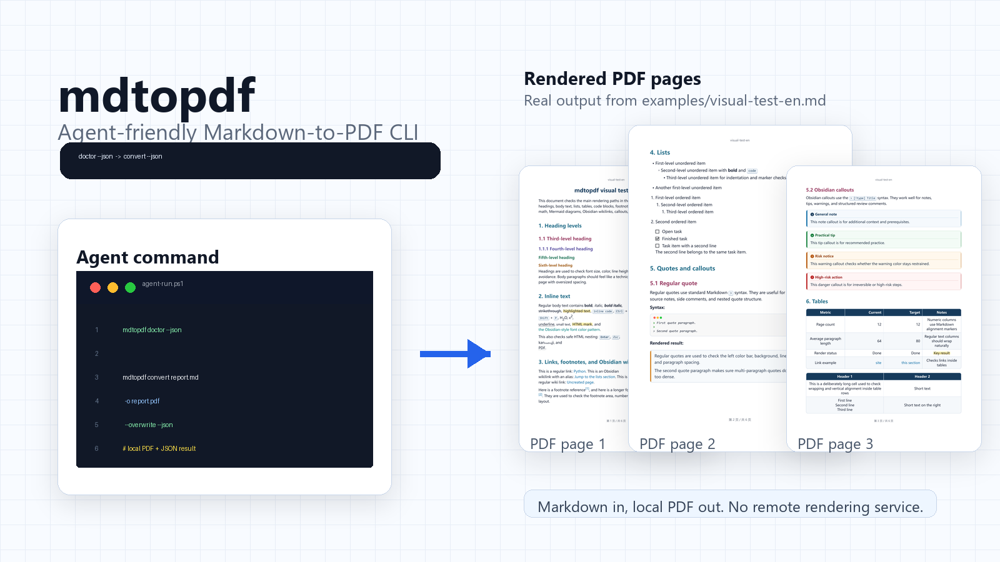
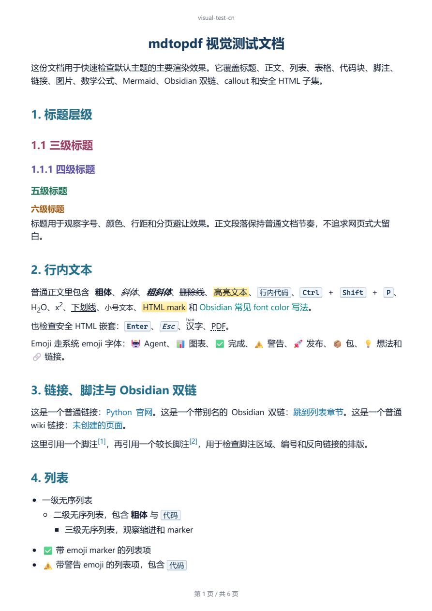
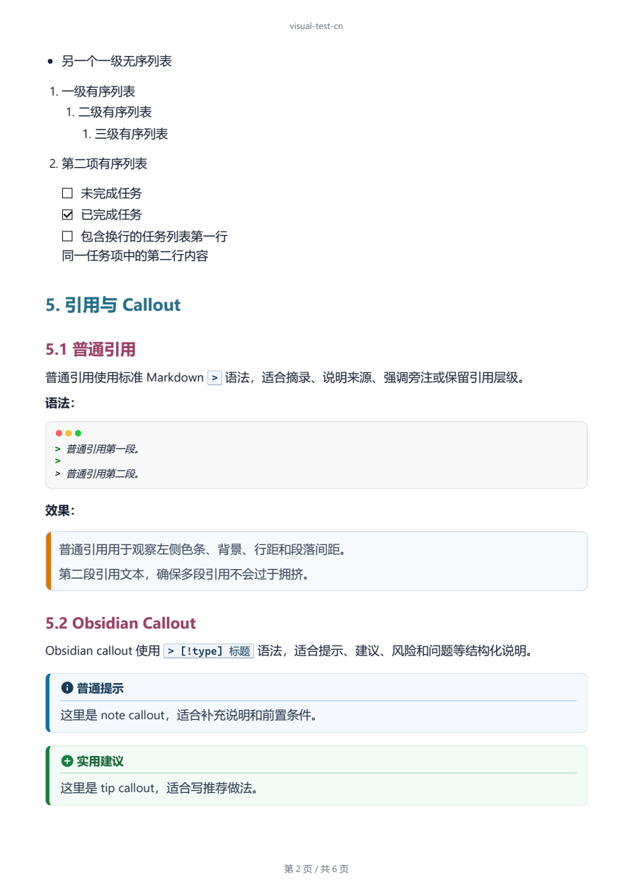
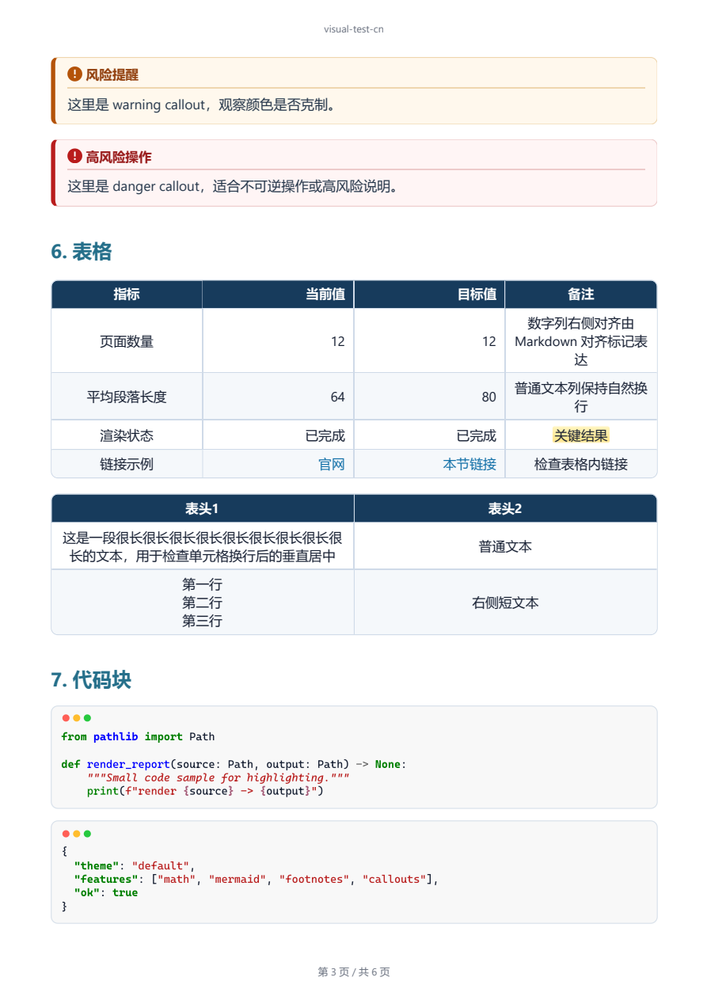
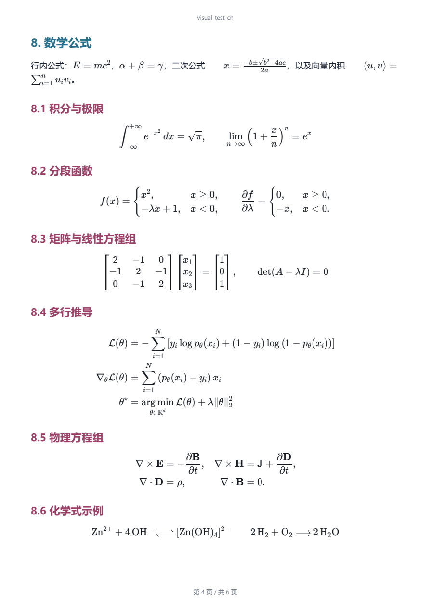
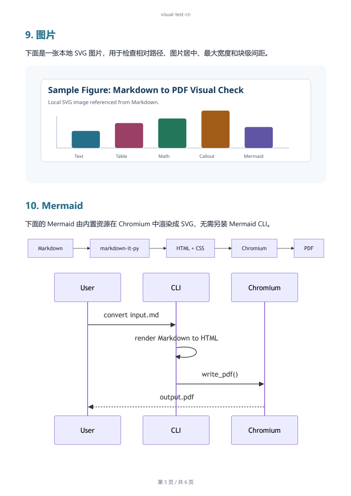
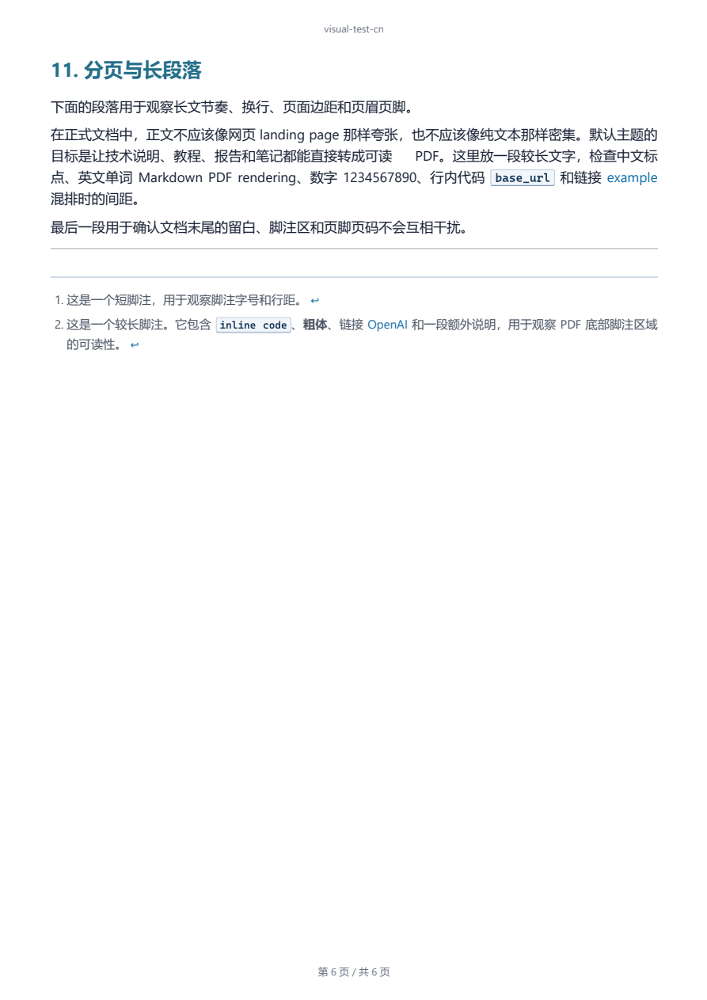

<h1 align="center">mdtopdf：面向 Agent 的 Markdown 转 PDF CLI</h1>

<p align="center">
  <a href="README.md">English README</a> | 中文文档
</p>

<p align="center">
  <a href="#快速上手"></a>
  <a href="#agent-调用方式"></a>
  <a href="#输出效果"></a>
  <a href="https://pypi.org/project/agent-markdown-pdf/"></a>
  <a href="https://github.com/ABClize/mdtopdf/blob/main/LICENSE"></a>
</p>

<p align="center">
  
  
  
  
</p>

**一行命令**，让Agent实现markdown转pdf自主可控。

<p align="center">
  
</p>

---

## 为什么适合 Agent 调用？

Agent 很擅长写 Markdown，但是它用各种方式导出的pdf样式无法统一，mdtopdf则是一个
能让用户提前定义样式的命令行接口。

- **Agent友好** - `mdtopdf --help` 是 Agent 能理解的接口说明。
- **需要时输出 JSON** - 转换、HTML 预览、环境检查、主题列表都可以返回结构化结果。
- **本地文件进，本地文件出** - 通过独立无头浏览器渲染，不上传文档，不依赖远程渲染服务。
- **不仅支持普通 Markdown** - Obsidian 双链、高亮、frontmatter、评论和 callout 都能渲染。

## 快速上手

安装：

```powershell
python -m pip install agent-markdown-pdf
```

PyPI 发行包叫 `agent-markdown-pdf`，安装后提供的命令仍然是 `mdtopdf`。
不要把 `mdtopdf` 当作 PyPI 包名；发布包名和命令名是故意分开的。

| 用途 | 名称 |
| --- | --- |
| 从 PyPI 安装 | `agent-markdown-pdf` |
| 执行 CLI | `mdtopdf` |
| Python import | `mdtopdf` |

检查本机环境：

```powershell
mdtopdf doctor --json
```

已安装的 Chrome、Edge 或 Chromium 会自动查找；找不到时再按[浏览器准备](#浏览器准备)
安装。第一次使用前建议运行 `doctor --render-check --json`，实际检查 PDF、公式和图表渲染。

转换文件：

```powershell
mdtopdf convert report.md -o report.pdf --overwrite
```

跑仓库里的测试文档：

```powershell
git clone https://github.com/ABClize/mdtopdf.git
cd mdtopdf
python -m pip install -e ".[dev]"
python -m playwright install chromium --no-shell
mdtopdf html examples/visual-test-cn.md -o visual-test-cn.html --overwrite
mdtopdf convert examples/visual-test-cn.md -o visual-test-cn.pdf --overwrite --json
```

同一份视觉测试也提供英文版：`examples/visual-test-en.md`。

## Agent 调用方式

内置 Agent skill 放在 `mdtopdf/skills/SKILL.md`，源码和 PyPI 包里都会带上。
其他 Agent 如果需要一份紧凑的调用说明，直接看这个文件就够了。

```powershell
mdtopdf doctor --json
mdtopdf convert report.md -o report.pdf --overwrite --json
```

Agent 也可以把 UTF-8 Markdown 直接传给 `convert -`，不必先保存输入文件。
必须用 `-o` 指定输出文件，PDF 内容不会混入终端的 JSON 输出。

Linux / macOS：

```shell
printf '# Report\n\nGenerated by an agent.\n' | mdtopdf convert - -o report.pdf --json
```

PowerShell（尤其是 Windows PowerShell 5.1，传中文前先设好管道编码）：

```powershell
$OutputEncoding = [System.Text.UTF8Encoding]::new($false)
'# 中文报告' | mdtopdf convert - -o report.pdf --json
```

相对资源默认从当前工作目录查找，可用 `--base-url` 改变；附件裸文件名仍支持
`--resource-dir`。标题和默认页眉为 `stdin`，可以用 `--title` 修改。
JSON 中会标明 `input: "-"` 和 `source: "stdin"`。空输入、非 UTF-8 输入会报错，
`--overwrite`、`--strict` 的规则与文件输入一致。`html` 命令暂时仍使用文件路径。

需要看版式时，加一个 HTML 预览：

```powershell
mdtopdf html report.md -o report.html --overwrite --json
mdtopdf convert report.md -o report.pdf --overwrite --json
```

`convert --json` 会返回输入路径、输出路径、文件大小、主题、字体检查摘要、warning 和渲染方式。转换失败时，
JSON 里会有结构化错误，Agent 可以直接把命令、原因和下一步修复建议交代清楚。

命令成功不代表内容一定完整：图片缺失、字体回退、不支持的公式保留为源码等情况都会记录在
`warnings` 里。不接受这些降级时，可以开启严格模式：

```powershell
mdtopdf convert report.md -o report.pdf --overwrite --strict --json
mdtopdf doctor --render-check --json
```

`--strict` 遇到诊断警告就停止，不替换已有输出。HTML 文件预览也支持这个参数，
包含公式或 Mermaid 时，预览会通过 Chromium 生成静态 HTML/SVG；纯 HTML
导出不启动浏览器，也不检查图片加载。`doctor --render-check` 会在同一次渲染中
检查 PDF、KaTeX 和 Mermaid，确认环境能运行，但不保证不同机器上的版式完全一致。
退出码：`0` 表示成功，`1` 表示运行环境或严格检查失败，`2` 表示参数有误。
缺少字体只提供建议；缺少浏览器或内置渲染资源会让基础检查失败。

## 输出效果

下面 6 张图来自 `examples/visual-test-cn.md`，能看到标题、Callout、表格、代码、
公式、图片、Mermaid 和分页的实际效果。

| 第 1 页 | 第 2 页 |
| --- | --- |
|  |  |
| 第 3 页 | 第 4 页 |
|  |  |
| 第 5 页 | 第 6 页 |
|  |  |

## 工作方式

```text
Markdown -> markdown-it-py HTML -> theme/custom CSS -> Chromium PDF
```

同一次 Chromium 会话负责内置 KaTeX 和 Mermaid 渲染，等待字体和图片加载后
打印 PDF。不再需要单独安装 Mermaid CLI、Node.js、WeasyPrint 或 MSYS2。
浏览器在准备环境时安装，转换过程不会自动下载。

## 功能特性

| 功能 | 说明 |
| --- | --- |
| JSON 输出 | `convert`、`html`、`doctor`、`themes list` 都支持 `--json`。 |
| 环境检查 | `doctor --json` 会检查 Python 包、浏览器路径、内置 KaTeX/Mermaid 资源和推荐字体。 |
| 本地渲染 | Markdown、CSS、数学公式、Mermaid SVG 生成和 PDF 导出都在本机完成。 |
| HTML 预览 | 生成 standalone HTML，用来快速检查最终 PDF 之前的排版。 |
| Obsidian 兼容 | 支持 wikilink、别名、frontmatter 隐藏、评论、高亮和 typed callout。 |
| 文档型 Markdown | 支持表格、任务列表、脚注、标题锚点、代码块和 Pygments 高亮。 |
| KaTeX 数学公式 | 内置 KaTeX 资源渲染行内和块级 TeX，不需要 CDN。 |
| 安全 HTML 默认值 | 常见文档标签可以用，危险的原始 HTML 默认转义。 |
| Python API | 可以在 Python 代码里转换字符串或文件。 |

## 常用命令

生成 PDF：

```powershell
mdtopdf convert report.md -o report.pdf
mdtopdf convert report.md -o report.pdf --overwrite
```

生成 HTML 预览：

```powershell
mdtopdf html report.md -o report.html --overwrite
```

设置标题、页眉、页脚：

```powershell
mdtopdf convert report.md -o report.pdf --title "Report"
mdtopdf convert report.md -o report.pdf --header "Report" --footer "Draft"
mdtopdf convert report.md -o report.pdf --no-header --no-footer
```

追加自定义 CSS 或指定资源目录：

```powershell
mdtopdf convert report.md -o report.pdf --css print.css
mdtopdf convert report.md -o report.pdf --base-url assets
mdtopdf convert report.md -o report.pdf --resource-dir attachments
```

自定义样式统一写在 CSS 里，不需要单独的字体参数。版心、字号、颜色、间距、字体都可以放进同一个 `print.css`。系统已安装的字体可以直接写 `font-family`；如果要随项目带本地字体文件，可以在 CSS 里写 `@font-face`。CSS 里的相对路径会按 Markdown 的 `--base-url` 解析，需要时显式传 `--base-url`。

```css
@font-face {
  font-family: "Report Sans";
  src: url("fonts/NotoSansSC-Regular.otf");
}

:root {
  font-family: "Report Sans", "Noto Sans SC", "Source Han Sans SC", sans-serif;
}

code,
pre {
  font-family: "Cascadia Code", "Liberation Mono", monospace;
}
```

然后把 CSS 传给转换命令：

```powershell
mdtopdf convert report.md -o report.pdf --css print.css --base-url .
```

导出时，`mdtopdf` 会检查最终 CSS 里的字体栈。字体缺失不会阻断 PDF 生成，但会在命令行 warning 和 JSON 的 `warnings` 字段里提示。
自定义 CSS 的首选字体缺失时，即使有备用字体，也会提示。对于本地 `@font-face`，
还会检查字体文件是否可读、是否覆盖文档中的中文，不能只写一个字体名就算检查通过。
静态检查不会下载远程字体，会将其标为未验证。字体检查不能代替实际查看 PDF；
需要拒绝警告时使用 `--strict`。

输出 JSON：

```powershell
mdtopdf --json convert report.md -o report.pdf --overwrite
mdtopdf doctor --json
mdtopdf themes list --json
```

只在可信 Markdown 中允许原始 HTML：

```powershell
mdtopdf convert trusted.md -o trusted.pdf --unsafe-html
```

HTML 过滤不等于文件系统或网络沙箱：图片和 CSS 仍可引用本地文件或远程地址。
处理不可信文档时，应在限制了文件访问和网络的环境中运行。

## Python API

```python
from mdtopdf import (
    markdown_file_to_html,
    markdown_file_to_pdf,
    markdown_to_html,
    markdown_to_pdf,
)

rendered = markdown_to_html("# Report\n\n==highlight==")
print(rendered.html)

markdown_to_pdf("# Report\n\nBody", "report.pdf", title="Report", overwrite=True)
markdown_file_to_html("report.md", output_path="report.html", overwrite=True)
markdown_file_to_pdf("report.md", output_path="report.pdf", overwrite=True)
```

## Markdown 支持

`mdtopdf` 支持：

- CommonMark
- 表格
- 删除线
- 任务列表
- 脚注
- 标题锚点
- Pygments 代码高亮
- Obsidian 风格 `==highlight==`
- Obsidian 风格 `[[target|alias]]` 双链
- Obsidian 风格 `%%comment%%` 注释隐藏
- YAML/frontmatter 隐藏
- Obsidian 风格 callout，例如 `> [!note] Title`
- 常见安全 HTML 标签，例如 `<br>`、`<kbd>`、`<mark>`、`<sup>`、`<sub>`
- `$inline$`、`$$block$$` 和常见 `amsmath` 环境
- 使用内置 Mermaid 在 Chromium 中渲染图表

默认情况下，`mdtopdf` 不会直接渲染任意原始 HTML；如果 Markdown 来源可信，可以显式加上 `--unsafe-html`。

## 浏览器准备

PDF 导出需要 Chromium；HTML 文档包含公式或 Mermaid 时也会用到它。
查找顺序固定为：`MDTOPDF_BROWSER_EXECUTABLE`、旧变量 `PUPPETEER_EXECUTABLE_PATH`、
Playwright 已安装的 Chromium，最后是 PATH 和 Windows/macOS 常见安装目录中的
Chrome、Edge、Chromium；Linux 还会检查标准安装路径。
显式配置的路径无效时直接报错，不会悄悄换浏览器。自动查找不会下载或安装软件。

没有可用浏览器时再安装一次：

```shell
python -m playwright install chromium --no-shell
mdtopdf doctor --render-check --json
```

`doctor --json` 会显示选中的路径和 `tools.browser.source`，加 `--render-check`
可以实际验证能否启动和渲染。找到可执行文件不代表系统库或沙箱环境一定完备。
也可以明确指定已安装的较新 Chrome 或 Edge：

```powershell
$env:MDTOPDF_BROWSER_EXECUTABLE = "C:\Program Files (x86)\Microsoft\Edge\Application\msedge.exe"
mdtopdf doctor --render-check --json
```

```shell
export MDTOPDF_BROWSER_EXECUTABLE="$(command -v google-chrome)"
mdtopdf doctor --render-check --json
```

未设置新变量时，仍兼容旧的 `PUPPETEER_EXECUTABLE_PATH`。每次转换使用独立的
无头会话，不打开你的个人浏览器配置。浏览器错误会返回原始信息、`error_code`
和修复建议 `hint`。

## 平台依赖

需要 Python 3.10+ 和较新的 Chromium。Python Playwright 包自带驱动，不需要另装
Node.js 或 npm。Windows 和 macOS 不再需要配置 MSYS2 或 Homebrew Pango。

在 Playwright 支持的 Debian/Ubuntu 环境中，先准备浏览器系统库，再安装文档字体：

```shell
python -m playwright install-deps chromium
sudo apt-get update
sudo apt-get install -y --no-install-recommends \
  fontconfig fonts-liberation fonts-dejavu-core fonts-noto-cjk fonts-stix
fc-cache -f
```

转换时使用**非 root 用户**，并保证浏览器沙箱可用。如果 Ubuntu/AppArmor 阻止下载
的浏览器启动，可明确指定符合宿主机策略的系统 Chrome，不要通过关闭沙箱绕过。
具体见 [Playwright 浏览器安装说明](https://playwright.dev/python/docs/browsers)。

默认主题保留 Latin-first 字体顺序。Linux 的英文和数字使用 Liberation Sans /
DejaVu Sans，中文使用 Noto Sans CJK SC；代码块优先 Cascadia Mono / Cascadia
Code，未安装时使用系统等宽字体。Debian 可安装 `fonts-cascadia-code`。
Windows 保留现有字体栈。微软雅黑和 Segoe UI Emoji 不是 Linux 依赖，mdtopdf
不会下载或打包这些字体。

Emoji 仍使用系统字体，现有 Linux 首选是单色 Noto Emoji，Noto Color Emoji
作为回退。更换引擎不意味着每种字体、每个 emoji 序列在不同系统上都完全一样，
交付前仍应检查代表性 PDF。KaTeX 自带数学字体，STIX 仅作为可选数学回退。

转换期间会阻止文档 JavaScript 执行，即使启用了 `--unsafe-html`。但图片、CSS、
字体仍可访问本地或远程资源，这不是文件系统或网络隔离；不可信文档应在限制访问
权限的环境中处理。使用 `--unsafe-html` 导出的 HTML 在其他浏览器打开时仍须
按可信内容处理。

## 开发与发布检查

```powershell
git clone https://github.com/ABClize/mdtopdf.git
cd mdtopdf
python -m pip install -e ".[dev]"
python -m playwright install chromium --no-shell
python -m pytest tests/ -q
```

构建并检查 PyPI 包：

```powershell
python -m build
python -m twine check dist/*
```

## 许可证

MIT。内置 KaTeX 和 Mermaid 资源附带各自的 MIT 许可证，见
`mdtopdf/vendor/katex/LICENSE` 和 `mdtopdf/vendor/mermaid/LICENSE`。

`mdtopdf` 不内置中文正文字体，也不分发 emoji 字体、微软雅黑、苹方、Segoe UI、
Segoe UI Emoji、Cascadia Code、Consolas 这类系统字体。默认主题会引用这些字体名，
但字体文件来自用户自己的操作系统或运行环境。公开 Linux 镜像建议使用上面的
Noto / Liberation / DejaVu / STIX 组合；emoji 需要稳定排版时优先用单色
`Noto Emoji`。
