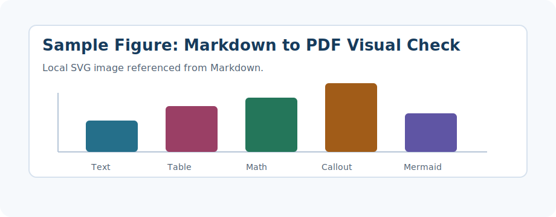
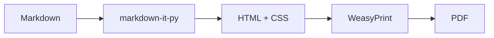
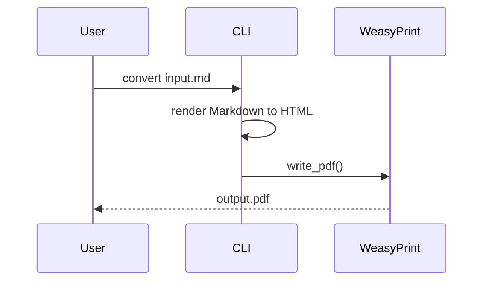

# mdtopdf 视觉测试文档

这份文档用于快速检查默认主题的主要渲染效果。它覆盖标题、正文、列表、表格、代码块、脚注、链接、图片、数学公式、Mermaid、Obsidian 双链、callout 和安全 HTML 子集。

%% 这是一段 Obsidian 注释，正常渲染时不应该出现在 PDF 中。 %%

<!-- 这是一段 HTML 注释，正常渲染时也不应该出现在 PDF 中。 -->

## 1. 标题层级

### 1.1 三级标题

#### 1.1.1 四级标题

##### 五级标题

###### 六级标题

标题用于观察字号、颜色、行距和分页避让效果。正文段落保持普通文档节奏，不追求网页式大留白。

## 2. 行内文本

普通正文里包含 **粗体**、*斜体*、***粗斜体***、~~删除线~~、==高亮文本==、`行内代码`、<kbd>Ctrl</kbd> + <kbd>Shift</kbd> + <kbd>P</kbd>、H<sub>2</sub>O、x<sup>2</sup>、<u>下划线</u>、<small>小号文本</small>、<mark>HTML mark</mark> 和 <font color="teal">Obsidian 常见 font color 写法</font>。

也检查安全 HTML 嵌套：**<kbd>Enter</kbd>**、*<kbd>Esc</kbd>*、<ruby>汉<rt>han</rt></ruby>字、<abbr title="Portable Document Format">PDF</abbr>。

## 3. 链接、脚注与 Obsidian 双链

这是一个普通链接：[Python 官网](https://www.python.org/)。这是一个带别名的 Obsidian 双链：[[#4. 列表|跳到列表章节]]。这是一个普通 wiki 链接：[[未创建的页面]]。

这里引用一个脚注[^note]，再引用一个较长脚注[^long-note]，用于检查脚注区域、编号和反向链接的排版。

[^note]: 这是一个短脚注，用于观察脚注字号和行距。

[^long-note]: 这是一个较长脚注。它包含 `inline code`、**粗体**、链接 [OpenAI](https://openai.com/) 和一段额外说明，用于观察 PDF 底部脚注区域的可读性。

## 4. 列表

- 一级无序列表
  - 二级无序列表，包含 **粗体** 与 `代码`
    - 三级无序列表，观察缩进和 marker
- 另一个一级无序列表

1. 一级有序列表
   1. 二级有序列表
      1. 三级有序列表
2. 第二项有序列表

- [ ] 未完成任务
- [x] 已完成任务
- [ ] 包含换行的任务列表第一行
  同一任务项中的第二行内容

## 5. 引用与 Callout

### 5.1 普通引用

普通引用使用标准 Markdown `>` 语法，适合摘录、说明来源、强调旁注或保留引用层级。

**语法：**

```markdown
> 普通引用第一段。
>
> 普通引用第二段。
```

**效果：**

> 普通引用用于观察左侧色条、背景、行距和段落间距。
>
> 第二段引用文本，确保多段引用不会过于拥挤。

### 5.2 Obsidian Callout

Obsidian callout 使用 `> [!type] 标题` 语法，适合提示、建议、风险和问题等结构化说明。

> [!note] 普通提示
> 这里是 note callout，适合补充说明和前置条件。

> [!tip] 实用建议
> 这里是 tip callout，适合写推荐做法。

> [!warning] 风险提醒
> 这里是 warning callout，观察颜色是否克制。

> [!danger] 高风险操作
> 这里是 danger callout，适合不可逆操作或高风险说明。

## 6. 表格

| 指标 | 当前值 | 目标值 | 备注 |
|---|---:|---:|---|
| 页面数量 | 12 | 12 | 数字列右侧对齐由 Markdown 对齐标记表达 |
| 平均段落长度 | 64 | 80 | 普通文本列保持自然换行 |
| 渲染状态 | 已完成 | 已完成 | ==关键结果== |
| 链接示例 | [官网](https://example.com) | [[#6. 表格\|本节链接]] | 检查表格内链接 |

| 表头1 | 表头2 |
|---|---|
| 这是一段很长很长很长很长很长很长很长很长很长的文本，用于检查单元格换行后的垂直居中 | 普通文本 |
| 第一行<br>第二行<br>第三行 | 右侧短文本 |

## 7. 代码块

```python
from pathlib import Path

def render_report(source: Path, output: Path) -> None:
    """Small code sample for highlighting."""
    print(f"render {source} -> {output}")
```

```json
{
  "theme": "default",
  "features": ["math", "mermaid", "footnotes", "callouts"],
  "ok": true
}
```

## 8. 数学公式

行内公式：$E = mc^2$，$\alpha + \beta = \gamma$，二次公式 $x=\frac{-b\pm\sqrt{b^2-4ac}}{2a}$，以及向量内积 $\langle u,v\rangle = \sum_{i=1}^{n}u_i v_i$。

### 8.1 积分与极限

$$
\int_{-\infty}^{+\infty} e^{-x^2}\,dx = \sqrt{\pi},
\qquad
\lim_{n\to\infty}\left(1+\frac{x}{n}\right)^n=e^x
$$

### 8.2 分段函数

$$
f(x)=
\begin{cases}
x^2, & x \ge 0,\\
-\lambda x + 1, & x < 0,
\end{cases}
\qquad
\frac{\partial f}{\partial \lambda}=
\begin{cases}
0, & x \ge 0,\\
-x, & x < 0.
\end{cases}
$$

### 8.3 矩阵与线性方程组

$$
\begin{bmatrix}
2 & -1 & 0\\
-1 & 2 & -1\\
0 & -1 & 2
\end{bmatrix}
\begin{bmatrix}
x_1\\x_2\\x_3
\end{bmatrix}
=
\begin{bmatrix}
1\\0\\1
\end{bmatrix},
\qquad
\det(A-\lambda I)=0
$$

### 8.4 多行推导

$$
\begin{aligned}
\mathcal{L}(\theta)
&= -\sum_{i=1}^{N}\left[y_i\log p_\theta(x_i)+(1-y_i)\log\left(1-p_\theta(x_i)\right)\right] \\
\nabla_\theta \mathcal{L}(\theta)
&= \sum_{i=1}^{N}\left(p_\theta(x_i)-y_i\right)x_i \\
\theta^\star
&= \operatorname*{arg\,min}_{\theta\in\mathbb{R}^d}\mathcal{L}(\theta)+\lambda\lVert\theta\rVert_2^2
\end{aligned}
$$

### 8.5 物理方程组

$$
\begin{aligned}
\nabla \times \mathbf{E} &= -\frac{\partial \mathbf{B}}{\partial t}, &
\nabla \times \mathbf{H} &= \mathbf{J}+\frac{\partial \mathbf{D}}{\partial t},\\
\nabla \cdot \mathbf{D} &= \rho, &
\nabla \cdot \mathbf{B} &= 0.
\end{aligned}
$$

### 8.6 化学式示例

$$
\ce{Zn^2+ + 4OH^- <=> [Zn(OH)4]^2-}
\qquad
\ce{2H2 + O2 -> 2H2O}
$$

## 9. 图片

下面是一张本地 SVG 图片，用于检查相对路径、图片居中、最大宽度和块级间距。



## 10. Mermaid

如果本机安装了 `mmdc`，下面的 Mermaid 会渲染成 SVG；否则会保留为代码块，便于确认降级路径。





## 11. 分页与长段落

下面的段落用于观察长文节奏、换行、页面边距和页眉页脚。

在正式文档中，正文不应该像网页 landing page 那样夸张，也不应该像纯文本那样密集。默认主题的目标是让技术说明、教程、报告和笔记都能直接转成可读 PDF。这里放一段较长文字，检查中文标点、英文单词 Markdown PDF rendering、数字 1234567890、行内代码 `base_url` 和链接 [example](https://example.com/) 混排时的间距。

最后一段用于确认文档末尾的留白、脚注区和页脚页码不会互相干扰。
