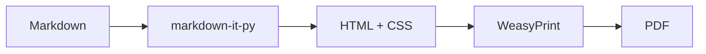
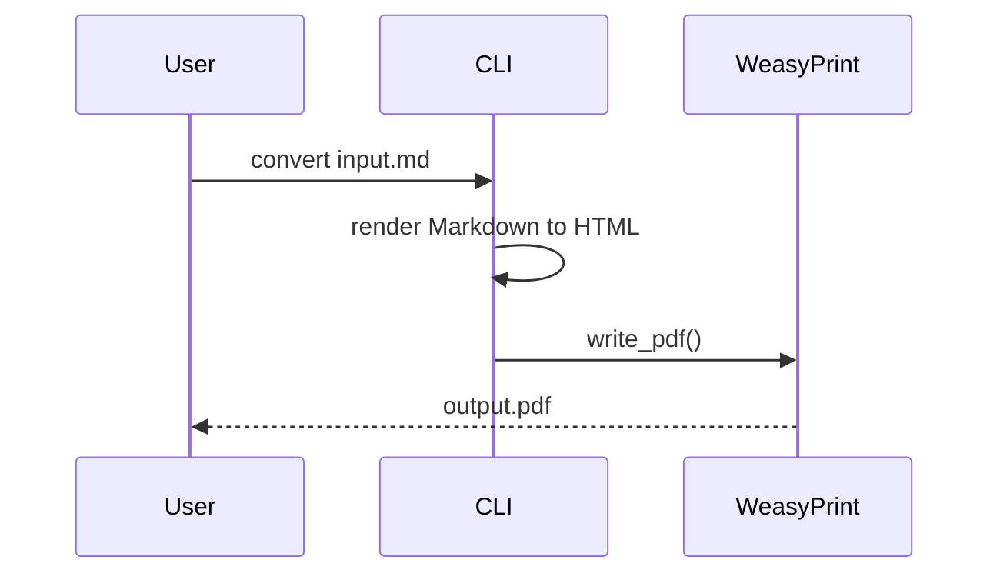

# mdtopdf visual test document

This document checks the main rendering paths in the default theme. It covers headings, body text, lists, tables, code blocks, footnotes, links, images, math, Mermaid diagrams, Obsidian wikilinks, callouts, and the safe HTML subset.

%% This Obsidian comment should not appear in the rendered PDF. %%

<!-- This HTML comment should not appear in the rendered PDF either. -->

## 1. Heading levels

### 1.1 Third-level heading

#### 1.1.1 Fourth-level heading

##### Fifth-level heading

###### Sixth-level heading

Headings are used to check font size, color, line height, and page-break avoidance. Body paragraphs should feel like a technical document, not a landing page with oversized spacing.

## 2. Inline text

Regular body text contains **bold**, *italic*, ***bold italic***, ~~strikethrough~~, ==highlighted text==, `inline code`, <kbd>Ctrl</kbd> + <kbd>Shift</kbd> + <kbd>P</kbd>, H<sub>2</sub>O, x<sup>2</sup>, <u>underline</u>, <small>small text</small>, <mark>HTML mark</mark>, and <font color="teal">the Obsidian-style font color pattern</font>.

This also checks safe HTML nesting: **<kbd>Enter</kbd>**, *<kbd>Esc</kbd>*, <ruby>kan<rt>reading</rt></ruby>ji, and <abbr title="Portable Document Format">PDF</abbr>.

Emoji markers use the system emoji font: 🤖 agent, 📊 chart, ✅ done, ⚠️ warning, 🚀 release, 📦 package, 💡 idea, and 🔗 link.

## 3. Links, footnotes, and Obsidian wikilinks

This is a regular link: [Python](https://www.python.org/). This is an Obsidian wikilink with an alias: [[#4. Lists|Jump to the lists section]]. This is a regular wiki link: [[Uncreated page]].

Here is a footnote reference[^note], and here is a longer footnote reference[^long-note]. They are used to check the footnote area, numbering, and backlink layout.

[^note]: This is a short footnote used to check footnote font size and spacing.

[^long-note]: This is a longer footnote. It contains `inline code`, **bold** text, a link to [OpenAI](https://openai.com/), and extra prose for checking readability at the bottom of the PDF page.

## 4. Lists

- First-level unordered item
  - Second-level unordered item with **bold** and `code`
    - Third-level unordered item for indentation and marker checks
- ✅ Emoji marker item with text
- ⚠️ Warning marker item with inline `code`
- Another first-level unordered item

1. First-level ordered item
   1. Second-level ordered item
      1. Third-level ordered item
2. Second ordered item

- [ ] Open task
- [x] Finished task
- [ ] Task item with a second line
  The second line belongs to the same task item.

## 5. Quotes and callouts

### 5.1 Regular quote

Regular quotes use standard Markdown `>` syntax. They are useful for excerpts, source notes, side comments, and nested quote structure.

**Syntax:**

```markdown
> First quote paragraph.
>
> Second quote paragraph.
```

**Rendered result:**

> Regular quotes are used to check the left color bar, background, line height, and paragraph spacing.
>
> The second quote paragraph makes sure multi-paragraph quotes do not become too dense.

### 5.2 Obsidian callouts

Obsidian callouts use the `> [!type] Title` syntax. They work well for notes, tips, warnings, and structured review comments.

> [!note] General note
> This note callout is for additional context and prerequisites.

> [!tip] Practical tip
> This tip callout is for recommended practice.

> [!warning] Risk notice
> This warning callout checks whether the warning color stays restrained.

> [!danger] High-risk action
> This danger callout is for irreversible or high-risk steps.

## 6. Tables

| Metric | Current | Target | Notes |
|---|---:|---:|---|
| Page count | 12 | 12 | Numeric columns use Markdown alignment markers |
| Average paragraph length | 64 | 80 | Regular text columns should wrap naturally |
| Render status | Done | Done | ==Key result== |
| Link example | [site](https://example.com) | [[#6. Tables\|this section]] | Checks links inside tables |

| Header 1 | Header 2 |
|---|---|
| This is a deliberately long cell used to check wrapping and vertical alignment inside table rows | Short text |
| First line<br>Second line<br>Third line | Short text on the right |

## 7. Code blocks

```python
from pathlib import Path

def render_report(source: Path, output: Path) -> None:
    """Small code sample for highlighting."""
    print(f"render {source} -> {output}")
```

```json
{
  "theme": "default",
  "features": ["math", "mermaid", "footnotes", "callouts"],
  "ok": true
}
```

## 8. Math

Inline formulas: $E = mc^2$, $\alpha + \beta = \gamma$, the quadratic formula $x=\frac{-b\pm\sqrt{b^2-4ac}}{2a}$, and the vector dot product $\langle u,v\rangle = \sum_{i=1}^{n}u_i v_i$.

### 8.1 Integrals and limits

$$
\int_{-\infty}^{+\infty} e^{-x^2}\,dx = \sqrt{\pi},
\qquad
\lim_{n\to\infty}\left(1+\frac{x}{n}\right)^n=e^x
$$

### 8.2 Piecewise functions

$$
f(x)=
\begin{cases}
x^2, & x \ge 0,\\
-\lambda x + 1, & x < 0,
\end{cases}
\qquad
\frac{\partial f}{\partial \lambda}=
\begin{cases}
0, & x \ge 0,\\
-x, & x < 0.
\end{cases}
$$

### 8.3 Matrix equation

$$
\begin{bmatrix}
2 & -1 & 0\\
-1 & 2 & -1\\
0 & -1 & 2
\end{bmatrix}
\begin{bmatrix}
x_1\\x_2\\x_3
\end{bmatrix}
=
\begin{bmatrix}
1\\0\\1
\end{bmatrix},
\qquad
\det(A-\lambda I)=0
$$

### 8.4 Multi-line derivation

$$
\begin{aligned}
\mathcal{L}(\theta)
&= -\sum_{i=1}^{N}\left[y_i\log p_\theta(x_i)+(1-y_i)\log\left(1-p_\theta(x_i)\right)\right] \\
\nabla_\theta \mathcal{L}(\theta)
&= \sum_{i=1}^{N}\left(p_\theta(x_i)-y_i\right)x_i \\
\theta^\star
&= \operatorname*{arg\,min}_{\theta\in\mathbb{R}^d}\mathcal{L}(\theta)+\lambda\lVert\theta\rVert_2^2
\end{aligned}
$$

### 8.5 Physics equations

$$
\begin{aligned}
\nabla \times \mathbf{E} &= -\frac{\partial \mathbf{B}}{\partial t}, &
\nabla \times \mathbf{H} &= \mathbf{J}+\frac{\partial \mathbf{D}}{\partial t},\\
\nabla \cdot \mathbf{D} &= \rho, &
\nabla \cdot \mathbf{B} &= 0.
\end{aligned}
$$

### 8.6 Chemistry examples

$$
\ce{Zn^2+ + 4OH^- <=> [Zn(OH)4]^2-}
\qquad
\ce{2H2 + O2 -> 2H2O}
$$

## 9. Images

The image below is a local SVG used to check relative paths, image centering, maximum width, and block spacing.


## 10. Mermaid

If `mmdc` is installed on the machine, the Mermaid blocks below render as SVG. Otherwise they remain as code blocks, which makes the fallback path visible.





## 11. Pagination and long paragraphs

The next paragraph checks long-form rhythm, line wrapping, page margins, and header/footer spacing.

In formal documents, body text should not look like a web landing page, but it also should not feel like a dense plain-text dump. The default theme aims to make technical notes, tutorials, reports, and generated agent drafts readable as PDFs without extra editing. This paragraph includes English words, Markdown PDF rendering, numbers 1234567890, inline code `base_url`, and a link to [example](https://example.com/) so mixed inline content can be inspected.

The final paragraph checks the whitespace at the end of the document, the footnote area, and footer page numbers.
